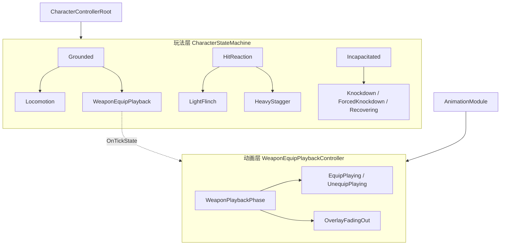
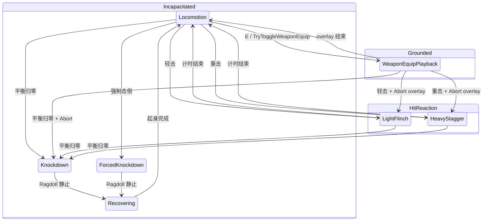

# 层次状态机（HSM）设计与使用指南

| 项 | 内容 |
|----|------|
| 文档版本 | 1.0 |
| 日期 | 2026-05-22 |
| 关联计划 | HSM 与武器模块剥离（阶段 A–D） |
| 架构总览 | [`角色控制器架构设计.md`](角色控制器架构设计.md) §4 |

---

> 说明：本文部分段落保留了阶段 A–D 时的历史命名（如 `AnimationModule`、`LocomotionModule`、`CombatModule`、`RecoveryModule`、`RagdollModule`）。  
> Note: Some sections keep historical names from phases A–D.
>
> 当前代码命名映射：
> - `AnimationModule` → `CharacterAnimationPresenter`
> - `LocomotionModule` → `CharacterMotor`
> - `CombatModule` → `CharacterCombat`
> - `RecoveryModule` → `CharacterRecoveryFlow`
> - `RagdollModule` → `CharacterRagdollSystem`（C8.6 后已移除 legacy 单骨架实现）

## 1. 阶段 A–D 完成情况

| 阶段 | 目标 | 交付物 | 状态 |
|------|------|--------|------|
| **A** | 从 `AnimationModule` 剥离装备 overlay，行为不变 | `WeaponEquipPlaybackController.cs`；`AnimationModule` 改为门面委托 | ✅ 已完成 |
| **B** | 受击硬直禁止拔刀/收刀 | `CharacterContext.CanToggleWeapon`；Root `CanToggleWeapon` / `TryToggleWeaponEquip` 守卫 | ✅ 已完成 |
| **C** | 完整玩法 HSM + `WeaponEquipPlayback` 子态 | `StateMachine/`、`CharacterState.WeaponEquipPlayback`、Root 接入 `_hsm` | ✅ 已完成 |
| **D** | 架构文档同步 | [`角色控制器架构设计.md`](角色控制器架构设计.md) §4、§6.2、§10（v1.3） | ✅ 已完成 |

**说明**：计划中的 `CharacterStateId.cs`、`CharacterStateTransitions.cs` 未单独建文件；子态直接使用现有 `CharacterState` 枚举，迁移表集中在 `CharacterStateMachine.BuildAllowedTransitions()`，与计划「显式迁移表、不引入第三方库」一致。

---

## 2. 设计动机

重构前存在三类问题：

1. **语义混杂**：`AllowsLocomotionInput` 同时表示「能移动」和「能拔刀」，轻击/重击期间仍可按 E。
2. **装备与玩法脱节**：拔刀播片由 `WeaponPlaybackPhase` 隐式挂在 `Locomotion` 的 Tick 里，状态图里看不出「拔刀是一种玩法状态」。
3. **`AnimationModule` 膨胀**：约 60% 代码是装备层权重与 CrossFade，与 Locomotion/Flinch 混在一起。

本 HSM 将 **何时能移动 / 能拔刀 / 能受击** 收敛到能力表，将 **装备 overlay 生命周期** 提升为 `Grounded.WeaponEquipPlayback` 子态，动画细节仍由 `WeaponEquipPlaybackController` 负责。

---

## 3. 两层状态：玩法 HSM vs 动画 Overlay



| 层 | 类 | 回答的问题 |
|----|-----|------------|
| **玩法 HSM** | `CharacterStateMachine` | 现在能不能走？能不能按 E 拔刀？受击后进哪个子态？ |
| **装备 Overlay** | `WeaponEquipPlaybackController` | 播哪一层、`wp_Equip*`、层权重、Moving 锁定、CrossFade |
| **Base Locomotion** | `AnimationModule.SyncLocomotionAnimator` | `Speed` / `Moving` / `Equipped`（Base 层 Idle/Run） |

进入 `WeaponEquipPlayback` **不等于** 停止 Base  locomotion：Root 在 `CanMove` 为真时仍每帧同步 `Speed`/`Moving`，子态只表示 **玩法锁（不可再按 E）与 overlay Tick 生命周期**。

---

## 4. 父态与子态

### 4.1 父态 `CharacterSuperstate`

用于文档叙述、调试 UI、后续 AI/假人规则分组：

| 父态 | 含义 |
|------|------|
| `Grounded` | 站立可控：正常移动或正在拔刀/收刀 |
| `HitReaction` | 受击硬直：可移动，不可发起拔刀 |
| `Incapacitated` | 击倒/起身：不可移动，不可拔刀，击倒期不可再受击 |

### 4.2 子态 `CharacterState`

```csharp
public enum CharacterState
{
    Locomotion,           // Grounded：待机/奔跑
    WeaponEquipPlayback,  // Grounded：拔刀/收刀播片
    LightFlinch,          // HitReaction
    HeavyStagger,         // HitReaction
    Knockdown,            // Incapacitated
    ForcedKnockdown,      // Incapacitated
    Recovering            // Incapacitated
}
```

### 4.3 能力矩阵（`CharacterStateCapabilities`）

每帧由 `CharacterStateMachine.Capabilities` 计算，并写入 `CharacterContext`：

| 子态 | 父态 | CanMove | CanToggleWeapon | CanReceiveHit |
|------|------|---------|-----------------|---------------|
| `Locomotion` | Grounded | ✓ | ✓ | ✓ |
| `WeaponEquipPlayback` | Grounded | ✓ | ✗ | ✓ |
| `LightFlinch` | HitReaction | ✓ | ✗ | ✓ |
| `HeavyStagger` | HitReaction | ✓ | ✗ | ✓ |
| `Knockdown` | Incapacitated | ✗ | ✗ | ✗ |
| `ForcedKnockdown` | Incapacitated | ✗ | ✗ | ✗ |
| `Recovering` | Incapacitated | ✗ | ✗ | ✗ |

能力定义位置：`Assets/Scripts/Character/StateMachine/CharacterStateCapabilities.cs` 的 `For(CharacterState)`。

---

## 5. 状态迁移图



**迁移表实现**：`CharacterStateMachine.cs` 内静态 `HashSet<(From, To)>`，由 `TryTransition(target, out reason)` 校验。非法迁移返回 `false`，Editor 下 Root 会打日志。

---

## 6. 运行时数据流（每帧）

```
Update:
  1. _hsm.Tick(dt)                    // 累计 TimeInState
  2. CombatModule.TickBalance
  3. 若 Capabilities.CanMove → LocomotionModule.TickMovement
  4. 各 ICharacterModule.OnTickState(CurrentState)
     - WeaponEquipPlayback → AnimationModule → WeaponEquipPlaybackController.Tick
  5. LightFlinch → UpdateFlinchWeight
  6. SyncLocomotionAnimator（CanMove 或 Recovering 等特殊逻辑）
  7. TickStateTransitions()          // 计时器、播片结束 → Locomotion 等
  8. SyncContext()                   // 快照写入 CharacterContext
```

**唯一修改「当前玩法子态」的路径**：`CharacterControllerRoot.TransitionTo` → `_hsm.TryTransition` → 各模块 `OnExitState` / `OnEnterState`。

---

## 7. 关键 API 如何使用

### 7.1 只读查询（推荐）

挂在 Player 上的 `CharacterControllerRoot`：

```csharp
var root = GetComponent<CharacterControllerRoot>();

// 当前子态与父态
CharacterState state = root.CurrentState;
CharacterSuperstate super = root.CurrentSuperstate;

// 能力（与 Context 一致）
bool canMove = root.AllowsLocomotionInput;  // == Capabilities.CanMove
bool canEquip = root.CanToggleWeapon;

// 每帧快照（调试、假人 AI）
var ctx = root.Context;
// ctx.State, ctx.Superstate, ctx.StateTime
// ctx.CanMove, ctx.CanToggleWeapon, ctx.IsWeaponEquipped
```

**假人 / 滚石**：继续调用 `root.ReceiveHit(HitContext)`，无需了解 HSM 内部；是否生效由 `CanReceiveHit` 与迁移表决定。

### 7.2 拔刀/收刀（玩家输入）

流程（`PlayerInputReader` → Root）：

1. `TryToggleWeaponEquip()` 检查 `CanToggleWeapon`（仅 `Locomotion` 为 true）。
2. `AnimationModule.TryToggleWeaponEquip(moving)` → 内部 `WeaponEquipPlaybackController.TryBeginToggle` 启动 overlay。
3. 成功则 `TransitionTo(WeaponEquipPlayback)`。
4. 在 `WeaponEquipPlayback` 期间每帧 `WeaponEquipPlaybackController.Tick`；overlay 完全结束（`IsEquipPlaybackInProgress == false`）后，`TickStateTransitions` 自动 `TransitionTo(Locomotion)`。

动画事件仍走原路径：`AnimationEventReceiver` → `NotifyWeaponEquipped` / `NotifyWeaponUnequipped` / `NotifyWeapon*PlaybackFinished`。

### 7.3 受击

```csharp
root.ReceiveHit(hitContext);
```

内部顺序：

1. 若 `!Capabilities.CanReceiveHit` → 直接 return（击倒/起身免疫）。
2. `CombatModule.ApplyBalanceDamage`（若非 Bypass）。
3. `CharacterStateMachine.ResolveHitTarget` 得到目标子态。
4. 若从 `WeaponEquipPlayback` 迁出到受击/击倒 → **先** `AbortWeaponEquipPlayback()`。
5. `TransitionTo(target)`。

### 7.4 调试

- 组件 `CharacterControllerDebug`：OnGUI 显示 `State (Superstate)`、`E=`（CanToggleWeapon）、Balance。
- Play 验收见 §9。

### 7.5 扩展新子态（开发者 checklist）

1. 在 `CharacterState` 枚举增加取值。
2. 在 `CharacterStateCapabilities.For` 填写 `CanMove` / `CanToggleWeapon` / `CanReceiveHit`。
3. 在 `CharacterStateMachine.BuildAllowedTransitions` 注册 `(From, To)` 边。
4. 在 `CharacterControllerRoot.TickStateTransitions` 添加退出条件（若需计时器）。
5. 在各 `ICharacterModule` 的 `OnEnterState` / `OnExitState` / `OnTickState` 增加 `switch` 分支。
6. 更新 [`角色控制器架构设计.md`](角色控制器架构设计.md) §4 与本文迁移图。

**不要**在子模块内直接 `TryTransition`；保持 §3.1 依赖规则：经 Root 中转。

---

## 8. 文件与职责对照

```
Assets/Scripts/Character/
  CharacterControllerRoot.cs       # 调度、TransitionTo、输入/受击/动画事件入口
  CharacterContext.cs              # 每帧能力快照
  CharacterState.cs                # 子态枚举（含 WeaponEquipPlayback）
  StateMachine/
    CharacterStateMachine.cs       # 迁移表、TimeInState、ResolveHitTarget
    CharacterSuperstate.cs         # 父态枚举
    CharacterStateCapabilities.cs  # 能力查询
  Modules/
    AnimationModule.cs             # Locomotion 参数 + Flinch；委托装备控制器
    WeaponEquipPlaybackController.cs
    LocomotionModule.cs
    CombatModule.cs / RagdollModule.cs / RecoveryModule.cs
```

| 类型 | 是否 MonoBehaviour | 谁构造 |
|------|------------------|--------|
| `CharacterStateMachine` | 否 | Root 字段 `readonly` |
| `WeaponEquipPlaybackController` | 否 | `AnimationModule` 构造函数内 `new` |
| 各 `*Module` | 否 | `Root.InitializeModules()` |

---

## 9. Play 模式验收清单

| # | 操作 | 预期 |
|---|------|------|
| 1 | `Locomotion` 下按 E | 进入 `WeaponEquipPlayback`，播拔刀/收刀 |
| 2 | 轻击/重击后立即按 E | **无效**（`CanToggleWeapon == false`） |
| 3 | 拔刀过程中调试 Light/Heavy | overlay 中止，进入 `LightFlinch` / `HeavyStagger` |
| 4 | 击倒/起身期间按 E | 无效 |
| 5 | 跑→停、停→跑过程中拔刀 | 无「抽一下」（overlay Moving 锁定 + CrossFade，见 Config） |
| 6 | 抓剑/背剑动画事件 | `Equipped` / 武器 Mesh 与逻辑 `IsWeaponEquipped` 一致 |
| 7 | 四向 **Light Hit**（C2） | Flinch 层动画 + 上身反冲；见 [`C2-轻击Flinch编辑器搭建.md`](C2-轻击Flinch编辑器搭建.md) |

---

## 10. 与 Config / 编辑器的关系

- **玩法 / 移动**：`CharacterControllerConfig`（`Assets/Configs/Player/DefaultCharacterControllerConfig.asset`）— 速度、平衡、受击时长。
- **动画 / 装备**：`CharacterAnimationConfig`（`DefaultCharacterAnimationConfig.asset`）— Animator 参数名、层名、装备 CrossFade、`movingSpeedThreshold` 等。
- **Root Inspector**：`Config` 与 `Animation Config` 两个引用槽，Player 预制体已默认绑定上述资产。
- **Animator**：层 `Base Layer` / **`FlinchLayer`** / `UpBodyLayer` / `FullBodyLayer`；C2 菜单 **Setup Player Flinch Layer**；事件由 `AnimationEventReceiver` 转发（C1 见 [`C1-角色控制器编辑器搭建.md`](C1-角色控制器编辑器搭建.md)）。
- **轻击冲量**：`CharacterControllerConfig` → `lightFlinchImpulse` 等。

HSM **不要求**改 Animator Controller 结构；仅增加玩法态 `WeaponEquipPlayback` 的代码侧表达。

---

## 11. 常见问题

**Q：为什么 `WeaponEquipPlayback` 还能移动？**  
A：题面要求击倒前仍可操控；拔刀属于 Grounded，腿部/Base 仍由 locomotion 驱动，上半身由 overlay 层播放。

**Q：`AnimationModule` 还会 Tick 装备逻辑吗？**  
A：仅在 `OnTickState(WeaponEquipPlayback)` 时调用 `_weaponEquip.Tick`，不再在 `Locomotion` 下偷偷 Tick。

**Q：如何禁止「播片中途再按 E」？**  
A：`CanToggleWeapon` 仅在 `Locomotion` 为 true；进入 `WeaponEquipPlayback` 后为 false。若 overlay 已结束但尚未迁回 `Locomotion`，`TryBeginToggle` 内部也会拒绝重复开始。

**Q：HSM 的 `StateChanged` 事件谁订阅？**  
A：当前由 Root 在 `TransitionTo` 内同步调用模块 Enter/Exit，未对外订阅；若 UI 需要可在此事件上挂监听。

---

## 12. 修订记录

| 版本 | 日期 | 说明 |
|------|------|------|
| 1.0 | 2026-05-22 | 初稿：A–D 完成说明、设计动机、API 与验收 |
