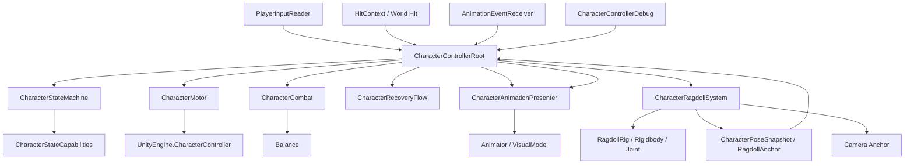

# Player 架构重构方案

| 项 | 内容 |
|----|------|
| 目标 | 重新划分 Player 内部模块边界，降低增量式修改造成的耦合 |
| 范围 | `CharacterControllerRoot`、移动、战斗、动画、Ragdoll、起身、调试、相机锚点 |
| 关联文档 | `角色控制器架构设计.md`、`C8-双骨架Ragdoll重构方案.md` |
| 状态 | 已执行至 P5（持续收口中） |

---

## 一、历史问题（已完成治理）

当前章节用于记录重构前的痛点，便于后续维护者理解为什么需要 P1~P5。  
Current section keeps pre-refactor pains as historical context.

重构前（历史阶段）职责逐渐混在一起：

- `CharacterControllerRoot` 不只调度状态，还直接持有 `Rigidbody[]`、收集 ragdoll 刚体、处理恢复锚点和根节点对齐。
- `RagdollModule` 同时负责刚体开关、冲量、重击选骨、沉降检测、恢复姿态快照、恢复锚点。
- `AnimationModule` 同时负责 Animator、轻击、装备、重击表现、起身 PoseMatch，并直接依赖 `RagdollModule.RecoveryPoseSnapshot`。
- `RecoveryModule` 既表示起身流程，又持有用于仰俯判定的骨骼引用。
- `CharacterControllerDebug` 早期信息源分散，后续若继续直接读各模块状态会放大耦合。

历史核心问题：

1. **Root 过重**：Root 变成状态机、流程编排、Ragdoll 配置、恢复对齐的混合体。
2. **表现层和玩法层互相泄漏**：Gameplay 状态知道太多 Animator / Rigidbody 细节。
3. **Ragdoll 系统没有独立边界**：双骨架、链定义、恢复姿态都应该属于一个独立表现系统。
4. **未来扩展成本高**：新增角色、不同受击策略或不同 ragdoll 配置时，很容易继续修改 Root。

---

## 二、重构目标

### 2.1 架构目标

- `CharacterControllerRoot` 只做**编排层**，不做具体业务。
- Gameplay 模块只负责规则，不关心 Animator、Rigidbody、骨骼。
- Presentation 模块只负责表现，不决定状态、不扣 Balance。
- Ragdoll 成为独立系统，可替换为双骨架实现。
- Debug 面板只通过 Root API 调试，不直接操作内部系统。
- 新角色接入时主要改配置和 Prefab 引用，不改 Root。

### 2.2 功能目标

- 保持现有输入、轻击、重击、击倒、起身、装备逻辑可迁移。
- 为双骨架 Ragdoll 预留清晰接口。
- 让重击局部物理、全身击倒、起身 pose match 都有明确归属。

---

## 三、推荐总体架构

推荐使用 **三层 + 两条总线**：

```text
Player
├── Orchestration / 编排层
│   └── CharacterControllerRoot
│
├── Gameplay / 玩法层
│   ├── CharacterStateMachine
│   ├── CharacterMotor
│   ├── CharacterCombat
│   └── CharacterRecoveryFlow
│
├── Presentation / 表现层
│   ├── CharacterAnimationPresenter
│   ├── CharacterRagdollSystem
│   └── CharacterCameraAnchorProvider
│
└── Data / 配置层
    ├── CharacterControllerConfig
    ├── CharacterAnimationConfig
    ├── RagdollSystemConfig
    └── RagdollChainCatalog
```

两条总线：

| 总线 | 说明 |
|------|------|
| `State Flow` | Root 根据状态进入/退出调用各模块 |
| `Pose Flow` | Animation 与 Ragdoll 之间通过独立 Pose 数据交换，不互相引用具体实现 |

---

## 四、目标依赖图



依赖原则：

- 只有 `CharacterControllerRoot` 可以知道所有模块。
- Gameplay 模块不依赖 Presentation 模块。
- Animation 不依赖 Ragdoll 的具体类，只接受独立 Pose 数据。
- Ragdoll 不依赖 AnimationModule，只知道 Visual 骨架和 Physics 骨架。

---

## 五、模块职责

### 5.1 `CharacterControllerRoot`

定位：Player 编排层。

保留职责：

- 接收输入、受击、动画事件。
- 持有 `CharacterStateMachine`。
- 决定状态迁移。
- 按固定顺序调用模块 Tick。
- 在状态进入时发出命令。

禁止职责：

- 不直接持有 `Rigidbody[]`。
- 不直接采样骨骼姿态。
- 不直接设置 Animator layer 权重。
- 不直接判断 ragdoll 仰俯。
- 不保存 ragdoll 链参数。

典型流程：

```text
ReceiveHit
→ CharacterCombat.ApplyHit
→ CharacterStateMachine.ResolveHitTarget
→ TransitionTo(target)
→ OnEnterState(target, context)
```

### 5.2 `CharacterMotor`

来源：历史 `LocomotionModule`（已迁移）。

职责：

- 读取 Root 传入的移动输入。
- 根据状态能力决定是否移动。
- 使用 `UnityEngine.CharacterController` 移动 Player root。
- 输出 `WorldVelocity` 给 Root / Animation。

不负责：

- 不决定状态。
- 不处理受击。
- 不操作 Animator。
- 不操作 Ragdoll。

### 5.3 `CharacterCombat`

来源：历史 `CombatModule`（已迁移）。

职责：

- 管理 Balance。
- 根据 `HitContext` 扣平衡值。
- 处理 Balance 自动恢复。
- 输出是否 Balance depleted。

不负责：

- 不决定进入哪个状态。
- 不播放动画。
- 不施加物理冲量。

### 5.4 `CharacterAnimationPresenter`

来源：历史 `AnimationModule`（已迁移）。

职责：

- 写 Animator 参数：`Speed`、`Moving`、`Equipped`、`HitBlendX/Z` 等。
- 播放轻击 Flinch 表现。
- 播放 HeavyStagger 动画表现。
- 管理武器装备/收回 overlay。
- 播放 GetUp 动画。
- 根据独立 PoseSnapshot 做 Recovery PoseMatch。

不负责：

- 不引用 `RagdollModule` / `CharacterRagdollSystem` 具体类型。
- 不采样 Rigidbody。
- 不判断沉降。

输入数据应改为：

```csharp
public readonly struct CharacterPoseSnapshot
{
    public readonly Transform[] Bones;
    public readonly Quaternion[] LocalRotations;
}
```

### 5.5 `CharacterRagdollSystem`

来源：替代历史 `RagdollModule`（已完成 C8.6 纯双骨架收口）。

职责：

- 管理双骨架映射：Visual ↔ Physics。
- 管理 Ragdoll 运行模式。
- 重击局部物理模拟。
- 全身击倒模拟。
- Physics 姿态回写到 Visual。
- 沉降检测。
- 捕获恢复 Pose。
- 捕获恢复 Anchor。
- 提供相机跟随 Anchor。

不负责：

- 不扣 Balance。
- 不决定状态。
- 不播放 Animator 状态。
- 不处理输入。

推荐 API：

```csharp
public void PlayHeavyReaction(in HitContext hitContext);
public void EnterFullRagdoll(in HitContext hitContext);
public void ReturnToAnimated();
public bool IsSettled { get; }
public CharacterPoseSnapshot CaptureRecoveryPose();
public RagdollAnchor CaptureRecoveryAnchor();
public RecoveryGetUpType EvaluateGetUpType();
public Transform CameraFollowAnchor { get; }
```

### 5.6 `CharacterRecoveryFlow`

来源：历史 `RecoveryModule` 瘦身迁移。

职责：

- 记录当前 `RecoveryGetUpType`。
- 管理 fallback recovery timer。
- 接收 GetUp 动画完成事件。
- 输出 `IsComplete`。

不负责：

- 不判断仰俯。
- 不采样 spine / torso。
- 不对齐 Root。
- 不播放动画。

### 5.7 `CharacterCameraAnchorProvider`

可选新增，或由 `CharacterRagdollSystem` 暂时承担。

职责：

- 根据当前状态返回相机跟随点。
- Locomotion / Recovering：跟随 Visual hips 或 Player root。
- Knockdown / ForcedKnockdown：跟随 Ragdoll physics hips/chest。

---

## 六、状态上下文设计

当前模块直接吃 `HitContext`，导致不是所有状态都有合适上下文。建议增加统一状态进入上下文。

```csharp
public readonly struct CharacterStateEnterContext
{
    public readonly CharacterState State;
    public readonly HitContext Hit;
    public readonly CharacterPoseSnapshot RecoveryPose;
    public readonly RagdollAnchor RecoveryAnchor;
    public readonly RecoveryGetUpType GetUpType;
}
```

用途：

- `HeavyStagger`：Animation 和 Ragdoll 读取 `Hit`。
- `Knockdown`：Ragdoll 读取 `Hit`。
- `Recovering`：Animation 读取 `RecoveryPose`，RecoveryFlow 读取 `GetUpType`。
- `Locomotion`：通常使用 default。

好处：

- 模块不需要互相访问。
- Root 仍是唯一编排点。
- 后续新增状态时不需要继续扩大模块私有依赖。

---

## 七、推荐目录结构

```text
Assets/Scripts/Character/
  CharacterControllerRoot.cs
  CharacterContext.cs
  CharacterState.cs
  HitContext.cs
  HitType.cs
  HitDirection.cs

  StateMachine/
    CharacterStateMachine.cs
    CharacterStateCapabilities.cs
    CharacterSuperstate.cs

  Gameplay/
    CharacterMotor.cs
    CharacterCombat.cs
    CharacterRecoveryFlow.cs

  Presentation/
    CharacterAnimationPresenter.cs

  Config/
    CharacterControllerConfig.cs
    CharacterAnimationConfig.cs

  Debug/
    CharacterControllerDebug.cs
    DebugHitContactRegion.cs
    HitDirectionDebugHelper.cs

Assets/Scripts/Ragdoll/
  CharacterRagdollSystem.cs
  RagdollMode.cs
  RagdollBoneMap.cs
  RagdollAnchor.cs
  RagdollChainCatalog.cs
  RagdollChainDefinition.cs
  RagdollSystemConfig.cs

Assets/Scripts/Camera/
  CameraFollowTargetDriver.cs
```

---

## 八、现有模块改动评估

| 模块 | 处理方式 | 说明 |
|------|----------|------|
| `CharacterStateMachine` | 保留 | 当前状态与迁移表仍可用 |
| `CharacterStateCapabilities` | 保留 | 能力表边界清晰 |
| `LocomotionModule`（历史） | 已完成重命名/迁移 | 现为 `CharacterMotor` |
| `CombatModule`（历史） | 已完成重命名/迁移 | 现为 `CharacterCombat` |
| `AnimationModule`（历史） | 已完成重命名并瘦身 | 现为 `CharacterAnimationPresenter`，不再依赖旧 ragdoll 类型 |
| `RagdollModule`（历史） | 已完成替换并删除 | 由 `CharacterRagdollSystem` 接管，C8.6 后无 legacy 回退 |
| `RecoveryModule`（历史） | 已完成瘦身迁移 | 现为 `CharacterRecoveryFlow` |
| `CharacterControllerRoot` | 重构 | 移除 ragdoll 细节，变成编排层 |
| `CharacterControllerDebug` | 持续收口 | 保持调 Root API，核心状态主读 `CharacterContext` |
| `CameraFollowTargetDriver` | 小改 | 跟随 Anchor 来源改为 Root/RagdollSystem 外观 |

---

## 九、迁移路线

### P1：建立边界，不改变行为

目标：

- 让 Root 先从 ragdoll 细节中抽身。

步骤：

1. 新建 `CharacterPoseSnapshot`、`RagdollAnchor` 独立数据类型。
2. 新建 `CharacterRagdollSystem` 外观。
3. （历史过渡）暂时把旧 `RagdollModule` 逻辑迁入或包装到 `CharacterRagdollSystem`。
4. Root 改为引用 `CharacterRagdollSystem`。
5. `CharacterAnimationPresenter` 改为接收 `CharacterPoseSnapshot`，不再引用 `RagdollModule.RecoveryPoseSnapshot`。

验收：

- 现有功能不退化。
- Root 不再序列化 `ragdollBodies`。
- Animation 不再依赖 `RagdollModule` 类型。

### P2：模块改名与目录整理

目标：

- 让代码目录表达真实职责。

步骤：

1. `LocomotionModule` → `CharacterMotor`。
2. `CombatModule` → `CharacterCombat`。
3. `RecoveryModule` → `CharacterRecoveryFlow`。
4. `AnimationModule` → `CharacterAnimationPresenter`。
5. 更新命名空间和引用。

验收：

- 编译通过。
- Inspector 序列化引用不丢失，或有明确迁移步骤。

### P3：接入双骨架 Ragdoll

目标：

- 将 `CharacterRagdollSystem` 内部实现改为双骨架。

步骤：

1. 新建 `RagdollRig` 物理骨架。
2. 建立 Visual ↔ Physics 映射。
3. Animated 模式同步 Physics 到 Visual。
4. HeavyStagger 使用 Physics 局部链模拟并回写 Visual。
5. Knockdown 使用 Physics 全身模拟并回写 Visual。

验收：

- 重击局部甩动明显。
- 不再出现单骨架脱节。
- 击倒和起身可逐步恢复到 C7 功能水平。

### P4：Root 瘦身与流程稳定

目标：

- Root 只保留编排逻辑。

步骤：

1. Root 删除 ragdoll 搜索、刚体数组、恢复采样细节。
2. Root 只处理状态上下文。
3. `CharacterContext` 增加必要调试字段，如 `RagdollMode`。
4. Debug 面板改读 Context。

验收：

- Root 字段按 Config / Module References / Runtime Debug 分组。
- Root 不再出现 `Rigidbody` 字段。
- Root 不再直接调用骨骼 Transform 采样 ragdoll 姿态。

### P5：文档与旧代码清理

目标：

- 保证未来维护者不会继续走回旧结构。

步骤：

1. 更新 `角色控制器架构设计.md`。
2. 更新 `架构设计.md`。
3. 将旧 C7 单骨架方案标记为历史实现。
4. 删除不再使用的旧字段和旧配置项。

---

## 十、建议 Player Prefab 目标结构

```text
Player
├── CharacterControllerRoot
├── PlayerInputReader
├── CharacterControllerDebug
├── UnityEngine.CharacterController
├── VisualModel
│   ├── Animator
│   ├── SkinnedMeshRenderer
│   └── Armature / mixamorig:*        // 可见动画骨架
└── RagdollRig
    └── Armature / mixamorig:*        // 隐藏物理骨架
        ├── Rigidbody
        ├── Collider
        └── Joint
```

Root 引用：

```text
Config
├── CharacterControllerConfig
├── CharacterAnimationConfig

Gameplay
├── Unity CharacterController

Presentation
├── Animator
├── CharacterRagdollSystem
```

RagdollSystem 引用：

```text
CharacterRagdollSystem
├── Visual Root
├── Physics Root
├── Animator
├── RagdollSystemConfig
└── RagdollChainCatalog
```

---

## 十一、编码规则

- 新增复杂逻辑必须保留中英双语注释。
- Root 中禁止出现新的物理实现细节。
- Gameplay 模块禁止引用 `UnityEngine.Animator`、`Rigidbody`、`Joint`。
- Presentation 模块禁止扣 Balance 或改变 HSM 状态。
- Debug 模块禁止绕过 Root 直接调用内部系统。
- Ragdoll 配置进入 `RagdollSystemConfig`，不要继续塞进 `CharacterControllerConfig`。

---

## 十二、风险与应对

| 风险 | 影响 | 应对 |
|------|------|------|
| 一次性重构过大 | 很难定位问题 | 按 P1-P5 分阶段迁移 |
| Prefab 序列化引用丢失 | 运行时报空引用 | 每阶段写明确编辑器检查步骤 |
| 类重命名破坏 `.meta` / Inspector | Unity 引用丢失 | 优先移动文件和改类名分开做 |
| 双骨架映射失败 | Ragdoll 不工作 | 先用日志列出缺失骨骼 |
| Recovery 迁移后起身异常 | 玩法闭环断裂 | 先保留旧 Recovery，重击验证通过后再迁移 |

---

## 十三、最终验收标准

- `CharacterControllerRoot` 只负责状态编排，不直接管理物理骨骼。
- `CharacterCombat` 可单独理解和测试 Balance 规则。
- `CharacterMotor` 可单独理解和测试移动。
- `CharacterAnimationPresenter` 不依赖 Ragdoll 具体实现。
- `CharacterRagdollSystem` 可独立替换单骨架/双骨架实现。
- Debug 面板仍能触发 Light Hit、Heavy Hit、Force KO。
- 双骨架重击局部效果明显，不脱节。
- 新角色接入时主要通过 Prefab 引用和配置资产完成。

---

## 十四、建议结论

建议先不要直接写双骨架逻辑，而是先完成 **P1：建立边界，不改变行为**。

优先顺序：

1. 抽出 `CharacterRagdollSystem` 外观。
2. 抽出独立 Pose / Anchor 数据类型。
3. Root 改为依赖 Ragdoll 外观。
4. AnimationModule 移除对旧 RagdollModule 类型的依赖。
5. 再开始双骨架实现。

这样做的好处是：即使双骨架第一版效果还需要调，Player 的整体架构也已经先变清晰，后续迭代不会继续把复杂度压回 Root。

---

## 十五、P1 执行记录

| 日期 | 内容 |
|------|------|
| 2026-05-23 | 已开始执行 P1：建立 Ragdoll 外观边界，不改变现有单骨架行为 |

已完成：

- 新增 `CharacterPoseSnapshot`：作为 Animation / Ragdoll 之间共享的姿态数据。
- 新增 `RagdollAnchor`：作为恢复对齐、朝向判断和相机锚点的数据。
- 新增 `CharacterRagdollSystem`：作为 Root 依赖的 Ragdoll 外观。
- `CharacterControllerRoot` 已改为调度 `CharacterRagdollSystem`，不再直接持有运行时 `_ragdoll` 模块引用。
- `AnimationModule` 已改为接收 `CharacterPoseSnapshot`，不再依赖 `RagdollModule.RecoveryPoseSnapshot`。
- `RagdollModule` 的恢复输出已改为独立数据类型，旧嵌套恢复类型已移除。

过渡保留（历史记录，已于 C8.6 结束）：

- 上述 legacy 兼容项均已移除：
  - Root 侧 `ragdollBodies` / `ragdollSearchRoot` 与自动收集链路已删除。
  - `CharacterRagdollSystem` 已切为纯双骨架后端，不再包装 `RagdollModule`。

验证：

- `dotnet build Assembly-CSharp.csproj --no-restore` 已通过，0 警告，0 错误。

---

## 十六、P2 执行记录（已完成：类名 + 目录）

| 日期 | 内容 |
|------|------|
| 2026-05-23 | 已完成 P2：模块改名与目录整理（不改变行为） |

已完成：

- 类名重命名：
  - `LocomotionModule` → `CharacterMotor`
  - `CombatModule` → `CharacterCombat`
  - `RecoveryModule` → `CharacterRecoveryFlow`
  - `AnimationModule` → `CharacterAnimationPresenter`
- 代码目录迁移：
  - `Assets/Scripts/Character/Modules/LocomotionModule.cs` → `Assets/Scripts/Character/Gameplay/CharacterMotor.cs`
  - `Assets/Scripts/Character/Modules/CombatModule.cs` → `Assets/Scripts/Character/Gameplay/CharacterCombat.cs`
  - `Assets/Scripts/Character/Modules/RecoveryModule.cs` → `Assets/Scripts/Character/Gameplay/CharacterRecoveryFlow.cs`
  - `Assets/Scripts/Character/Modules/AnimationModule.cs` → `Assets/Scripts/Character/Presentation/CharacterAnimationPresenter.cs`
- `CharacterControllerRoot` 已更新字段类型与构造调用，统一使用新模块名。
- 注释与日志中的旧模块名引用已同步替换为新命名。
- 对应 `.meta` 文件已随迁移一起移动，保持 Unity 资源引用连续性。

验证：

- 全局检索无旧类名残留引用（`LocomotionModule`、`CombatModule`、`RecoveryModule`、`AnimationModule`）。
- `dotnet build Assembly-CSharp.csproj --no-restore` 已通过，0 警告，0 错误。

---

## 十七、P3 执行参考（双骨架重构）

P3 阶段双骨架实现以 `docs/C8-双骨架Ragdoll重构方案.md` 为主文档，当前方案仅保留迁移入口与验收映射。

推荐按以下顺序执行：

1. 先完成 `RagdollRig`（隐藏物理骨架）搭建与 Visual/Physics 骨骼映射。
2. 在 `CharacterRagdollSystem` 内部替换旧单骨架包装，实现 `Animated / PartialRagdoll / FullRagdoll / PoseMatching / Recovering` 模式流转。
3. 保持 `CharacterControllerRoot` 只调外观 API，不回流新增物理细节字段。
4. 用 C8 中定义的重击局部甩动、全身击倒、起身 PoseMatch 指标做验收。

与本方案 P3 验收对齐关系：

- “重击局部甩动明显” → 对齐 C8 `PartialRagdoll` 目标。
- “不再出现单骨架脱节” → 对齐 C8 双骨架控制权分离目标。
- “击倒和起身恢复到 C7 水平” → 对齐 C8 `FullRagdoll + PoseMatching + Recovering` 闭环目标。

---

## 十八、P3 / C8.6 执行记录（移除 legacy 链路）

| 日期 | 内容 |
|------|------|
| 2026-05-23 | 已完成 C8.6：移除旧单骨架 `RagdollModule` 与 legacy 回退分支 |

已完成：

- `CharacterRagdollSystem` 已改为仅双骨架后端，删除 `Allow Legacy Fallback` 与所有旧分支。
- `CharacterControllerRoot` 已删除 `ragdollBodies` 等 legacy 字段与自动收集逻辑。
- `CharacterControllerRootEditor` 已移除“收集 Ragdoll Rigidbody”按钮，改为双骨架配置提示。
- `CharacterControllerDebug` 已移除 `LegacyFallback` 展示语义，统一为 `Dual / Unavailable`。
- `CharacterContext` 已承载核心 Ragdoll 调试快照，Debug 面板主读 Context。
- `Assets/Scripts/Character/Modules/RagdollModule.cs` 与 `.meta` 已删除。
- `Assembly-CSharp.csproj` 已移除 `RagdollModule` 编译项。
- `CharacterRagdollSystem.InitializeRuntime(...)` 已去除对 `CharacterControllerConfig` / `CharacterAnimationConfig` 的 Ragdoll 参数回退依赖。
- `CharacterRagdollSystem` 的重击局部与沉降参数已统一以 `RagdollSystemConfig` 为主；缺失时仅使用内置默认值并输出提示。
- `Player.prefab` 上的 `CharacterRagdollSystem` 已补齐 `RagdollSystemConfig` 默认引用，避免仅依赖场景实例 override。

影响说明：

- 当前版本不再提供单骨架兜底，若双骨架引用或映射缺失，后端将显示 `Unavailable`。
- 需在 Prefab 上确保 `CharacterRagdollSystem` 的 `Visual Root / Physics Root / Animator / RagdollSystemConfig / RagdollChainCatalog` 引用完整。

---

## 十九、P4 / P5 收尾记录（2026-05-23）

本轮完成：

- **P4（Root 瘦身与流程稳定）收尾**：
  - `CharacterContext` 新增 Ragdoll 调试快照字段：`IsRagdollSettled`、`RagdollMode`、`RagdollBackendStatus`、`RagdollChainName`、`RagdollMappedBoneCount`、`IsUsingDualRagdoll`。
  - `CharacterControllerRoot.SyncContext()` 已统一写入上述字段。
  - `CharacterControllerDebug` 面板中的 Ragdoll 状态显示已改为优先读取 `Context`，减少对 Root 直接状态读取耦合。

- **P5（文档与旧结构清理）推进**：
  - 本文顶部状态更新为“已执行至 P5（持续收口中）”。
  - P1 段落中的 legacy 过渡描述已标注为历史记录并说明 C8.6 已完成移除。
  - `docs/角色控制器架构设计.md` 已完成 C8.6 语义同步（纯双骨架、无 legacy 回退）。
  - `docs/架构设计.md` 按总览文档定位补充“当前实现映射”说明，标记旧模块名为历史抽象。
  - `CharacterRagdollSystem` 参数边界已进一步收口：不再从 `CharacterControllerConfig` / `CharacterAnimationConfig` 回退读取 Ragdoll 参数。
  - `Player.prefab` 已固化 `RagdollSystemConfig` 默认引用，`Ragdoll` 参数来源统一为 `RagdollSystemConfig`（或内置默认值）。

### P5 续：模块瘦身与目录整理（2026-05-26）

本轮聚焦 Root 瘦身与目录一致性：

- **提取 `CharacterDebugHitDriver`**：从 `CharacterControllerRoot` 中抽走 ~270 行调试 API（`DebugHitLight/Heavy`、`DebugForceKnockdownLight/Heavy`、`GetDebugContactPoint`），放入 `Assets/Scripts/Character/Debug/`。该模块仅被 `CharacterControllerDebug` 使用，构造函数注入 `root`/`animator`/`ragdollSystem`。
- **提取 `CharacterRecoveryAlignment`**：从 Root 中抽走 ~150 行起身对齐逻辑（位置校正、朝向判定、地面 raycast、兜底时长计算），放入 `Assets/Scripts/Character/Gameplay/`。构造函数注入 `rootTransform`/`animator`/`cc`/`animConfig`/`preAlignRotation`/`forceAlignMinAngle`。
- **文件迁移**：`CharacterRagdollSystem.cs` 从 `Assets/Scripts/Character/` 移至 `Assets/Scripts/Ragdoll/`，与 `RagdollBoneMapper`/`RagdollChainCatalog`/`RagdollSystemConfig` 同目录。
- **CLAUDE.md 更新**：修正过时模块名，新增 `模块边界规则` 节（依赖方向、文件放置规则、Root 瘦身原则、行数参考）。
- **Root 行数**：1245 → 693（-44%）。
