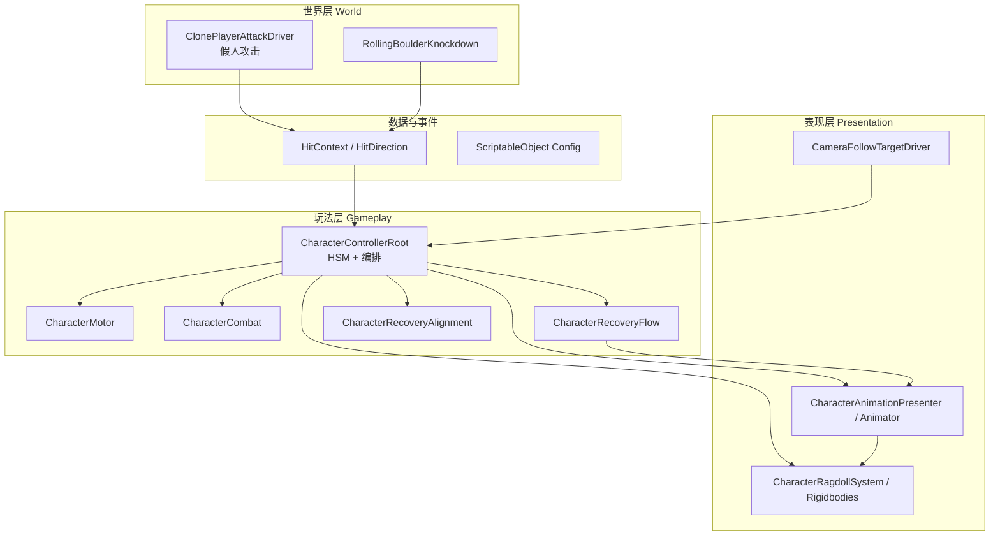
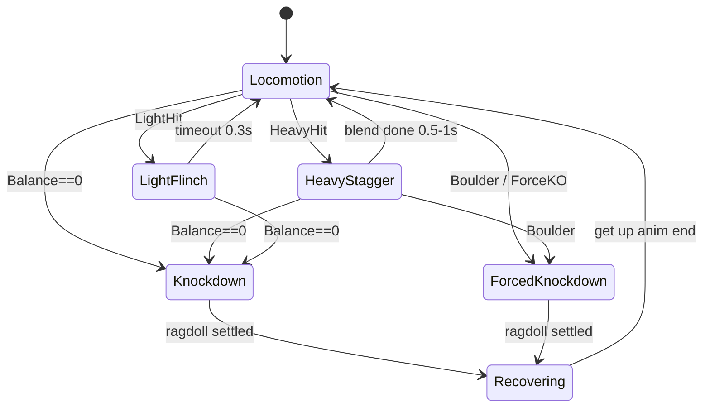
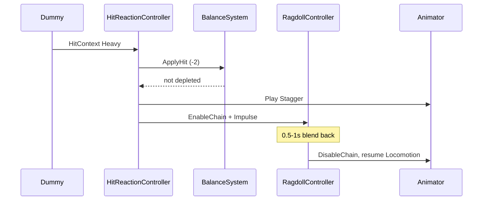
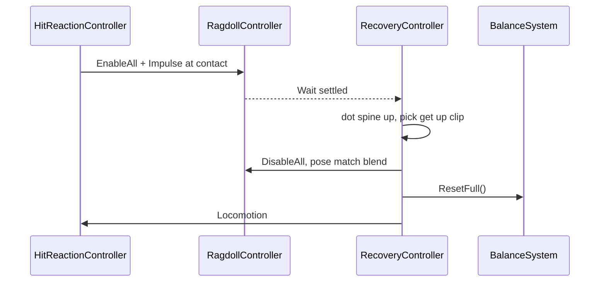

# 主动式布娃娃系统 — 架构设计

| 项 | 内容 |
|----|------|
| 文档版本 | 1.1 |
| 日期 | 2026-05-23 |
| 需求来源 | [`Unity_测试任务.pdf`](Unity_测试任务.pdf) |
| 引擎 | Unity **6000.3.13f1 (LTS)** |
| 状态 | 持续更新中（角色控制器以 C8.6 现状为准） |

---

## 1. 背景与目标

### 1.1 业务目标

在俯视角 3D 场景中，为**玩家人形角色**实现一套 **主动式布娃娃（Active Ragdoll）** 系统，满足：

- 受击力度分级响应：轻击晃动 → 重击局部物理 → 平衡耗尽/滚石碰撞全身倒地 → 自然沉降后姿态匹配起身；
- **动画驱动**与**刚体物理驱动**之间可平滑切换、可配置融合权重；
- 配套测试场景：两组假人、循环路径滚石，用于验收各机制。

### 1.2 非目标（本期不做）

- 玩家主动攻击、连招、锁定
- 网络多人、存档、完整 UI 流程
- 复杂 AI 寻路（假人仅原地/定时/连续攻击）
- 高品质角色控制器（仅需 WASD 移动 + Idle/Run）

### 1.3 参考

| 类型 | 参考 |
|------|------|
| 镜头 | *No Rest for the Wicked* — 俯视角跟随 |
| 手感取向 | *Exanima*、*Hellish Quart* — 物理化受击与硬直 |

---

## 2. 约束与技术栈

| 约束 | 说明 |
|------|------|
| Unity 版本 | **6000.3.13f1**，见 `ProjectSettings/ProjectVersion.txt` |
| 渲染 | URP 17.x（`com.unity.render-pipelines.universal`） |
| 输入 | Input System 1.19（`Assets/InputSystem_Actions.inputactions`） |
| 角色资源 | 出题方提供：`Assets/Models/animation_pack.fbx` 等 |
| 场景几何 | Primitive 搭建即可 |
| 代码位置 | `Assets/Scripts/`（按下文模块分子目录） |

**物理**：3D Physics（`Rigidbody` + `Collider` + `CharacterJoint` 或 `ConfigurableJoint`，实现阶段选型见 §6.3）。

---

## 3. 系统总览

> **核心实现以角色控制器为准**，详见 [`角色控制器架构设计.md`](角色控制器架构设计.md)。  
> 下文模块名（如 `HitReactionController`）在实现时收敛为 `CharacterControllerRoot` 的子模块。

### 3.0 当前实现映射（C8.6）

为避免与早期草案命名混淆，当前代码实现采用如下映射：

| 草案抽象名 | 当前实现（代码） |
|-----------|------------------|
| `PlayerMovement` | `CharacterMotor` + `PlayerInputReader` |
| `BalanceSystem` | `CharacterCombat` |
| `HitReactionController` | `CharacterControllerRoot`（状态编排入口） |
| `RagdollController` | `CharacterRagdollSystem`（双骨架） |
| `RecoveryController` | `CharacterRecoveryFlow` + `CharacterRecoveryAlignment` + `CharacterAnimationPresenter` |
| （无草案对应，C9+细化） | `CharacterDebugHitDriver`（调试受击注入） |
| （无草案对应，C9+细化） | `CharacterAttackPlaybackController`（攻击 overlay） |

当前关键约束（已落地）：

- Ragdoll 后端仅支持双骨架，状态语义为 `Dual / Unavailable`。
- 旧单骨架 `RagdollModule` 与 legacy fallback 链路已移除。
- Root 调试面板主读 `CharacterContext` 快照字段，避免调试逻辑继续放大耦合。
- `CharacterRagdollSystem` 的 Ragdoll 参数不再回退依赖 `CharacterControllerConfig` / `CharacterAnimationConfig`。
- `Player.prefab` 默认绑定 `RagdollSystemConfig`，Ragdoll 参数来源统一为 `RagdollSystemConfig`（缺失时使用内置默认值）。
- 全身击倒姿态回写使用世界空间同步（Visual 骨骼对齐 Physics 骨骼世界位姿），避免双骨架根节点局部基准差导致朝向错位。
- Recovery 锚点朝向优先使用 `hips->head` 平面轴向并带多级回退；`Front` 起身沿 `hips->head`，`Back` 起身沿 `head->hips`，降低起身入口朝向抖动与位置突跳。
- 参数归属收敛：重击局部/沉降相关参数仅归属 `RagdollSystemConfig`，Root 不再持有 Ragdoll 默认回退参数；`CharacterControllerConfig` 仅保留移动/平衡/轻击表现，`CharacterAnimationConfig` 仅保留 Animator/装备/起身播放参数。

### 3.1 逻辑分层



### 3.2 核心原则

1. **单一入口处理受击**：所有伤害来源（假人、滚石、调试面板）统一构造 `HitContext`，交给 `CharacterControllerRoot.ReceiveHit()`，避免分支散落。
2. **状态机驱动角色模式**：明确区分 `Locomotion` / `LightFlinch` / `HeavyStagger` / `Knockdown` / `ForcedKnockdown` / `Recovering`，禁止多系统同时写 Animator 与 Rigidbody 开关。
3. **物理只在需要时启用**：轻击不启 ragdoll；重击仅启命中骨骼链（双骨架局部物理）；击倒启全身后再全关。
4. **可调参**：平衡值、恢复时间、冲量、融合时长进 `SerializeField` 或 SO，便于验收调手感。

---

## 4. 角色状态机

### 4.1 状态定义

| 状态 | 说明 | 玩家控制 | Animator | Ragdoll |
|------|------|----------|----------|---------|
| `Locomotion` | 待机/奔跑 | 是 | 全权 | 关 |
| `LightFlinch` | 轻击反应 | 是（题面：保持完整操控） | 上半身定向 Layer 融合 | 关 |
| `HeavyStagger` | 重击 | 部分（下半身动画） | 下半身 + Stagger；命中链物理 | 局部开 |
| `Knockdown` | 击倒 | 否 | 关或仅 Root 跟踪 | 全开 |
| `Recovering` | 起身 | 否 | 姿态匹配 → Get Up → Idle | 渐关 |
| `ForcedKnockdown` | 滚石等 | 否 | 同 Knockdown | 全开；可忽略 Balance |

### 4.2 状态转换（简图）



### 4.3 与平衡值关系

- 轻击：Balance −1；未归零 → 仅 `LightFlinch`（若当前可受击）
- 重击：Balance −2；未归零 → `HeavyStagger`
- Balance == 0：下一帧或同次命中流程进入 `Knockdown`，**击倒结束后 Balance 重置为 6**
- 1.5–2 s 无受击：`BalanceSystem` 开始回复（可线性/阶梯，默认线性）

---

## 5. 模块设计

> **注意：第 5–9 节为设计阶段草案。** 当前实现以 [`角色控制器架构设计.md`](角色控制器架构设计.md) 为准，第 3.0 节提供了草案名到实现类的映射。本章保留供设计思路回溯，类名与模块划分请勿直接引用。

### 5.1 `HitContext`（数据结构）

统一描述一次打击，供全链路传递：

| 字段 | 类型 | 说明 |
|------|------|------|
| `HitType` | enum | `Light` / `Heavy` / `ForceKnockdownLight` / `ForceKnockdownHeavy` |
| `Direction` | Vector3 或 enum4 | 世界空间受击方向（前/后/左/右），用于轻击与冲量 |
| `ContactPoint` | Vector3 | 接触点，击倒施力点 |
| `Impulse` | float | 冲量大小（可配置基值 × 类型系数） |
| `Source` | Component ref | 假人/滚石，调试用 |
| `BypassBalance` | bool | 滚石为 true |

### 5.2 `BalanceSystem`

**职责**：维护当前平衡值、受伤冷却、自动恢复、击倒触发信号。

| 接口（示意） | 说明 |
|--------------|------|
| `ApplyHit(HitContext)` | 扣点；若 ≤0 发出 `OnBalanceDepleted` |
| `ResetFull()` | 击倒流程结束后调用 |
| `Current` / `Max` | 默认 6 / 6 |

**规则（题面初始值，可配置）**：

- Light → −1；Heavy → −2
- 无受击 **1.5–2 s** 后开始恢复（恢复速率可配）
- `BypassBalance` 时不扣点，由 `HitReactionController` 直接走 `ForcedKnockdown`

### 5.3 `HitReactionController`

**职责**：角色受击总线；根据 `HitContext` + 当前状态决定下一状态。

```
OnHit(HitContext ctx):
  if ctx.BypassBalance → Enter ForcedKnockdown(ctx)
  else BalanceSystem.ApplyHit(ctx)
  if depleted → Enter Knockdown(ctx)
  else switch ctx.HitType → LightFlinch / HeavyStagger
```

**并发**：击倒/起身过程中忽略新轻击，或仅叠加 Balance（建议：**击倒态免疫新 hit**，简化实现）。

### 5.4 `RagdollController`

**职责**：管理骨骼刚体启用集、关节、与 Animator 的互斥/混合。

| 模式 | 行为 |
|------|------|
| `DisableAll` | 运动态；Animator IK/骨骼正常 |
| `EnableChain(boneRoot)` | 重击：从命中骨骼向上/向下解析链（如右肩→右手指+脊柱上段） |
| `EnableAll` | 击倒：全部 ragdoll 刚体 kinematic=false |
| `ApplyImpulse(point, dir, magnitude)` | `AddForceAtPosition`，击倒时必须用接触点 |

**与 Animator**：

- 全 ragdoll：`Animator.enabled = false` 或 `updateMode = AnimatePhysics` + 骨骼跟随（二选一，实现时选 **disable + 手动对齐根骨骼** 更简单）
- 局部 ragdoll：Animator 继续；对已进入物理的骨骼 **Animator.culling / 局部权重 0** 或使用 **Animation Rigging**（若包允许）— **首选**：物理骨骼与动画骨骼分离映射表，物理骨覆盖动画

**融合回动画（重击结束）**：

- 0.5–1 s 内：`Rigidbody.isKinematic` 渐 true + 位置 slerp 向 Animator 采样姿态
- 完成后 `DisableChain`

### 5.5 `RecoveryController`

**职责**：击倒后检测静止 → 判定仰/俯 → 姿态匹配混合 → 播放起身 → 回 Idle。

| 步骤 | 说明 |
|------|------|
| 静止检测 | 各主要 `Rigidbody.velocity.magnitude < ε` 持续 T 秒（如 0.3s） |
| 姿态判定 | `dot(spine.up, world.up)` > 0 → 仰卧 Get Up From Back；否则俯卧 Get Up From Front |
| 匹配混合 | 记录 ragdoll 关键骨骼旋转/位置，对齐至起身动画首帧（Pose Match）；可用 Unity 6 Animation 采样或第三方 pose 工具 — **MVP**：snap 根位置 + 上半身旋转 blend 0.2s |
| 结束 | 事件 `OnRecoveryComplete` → `BalanceSystem.ResetFull()` + `Locomotion` |

### 5.6 `PlayerMovement`

**职责**：俯视角平面移动（XZ），输入 WASD / 虚拟摇杆。

- `CharacterController` **或** `Rigidbody` + 约束：**建议 CharacterController** 用于日常移动，击倒时禁用，ragdoll 接管根运动
- 速度、加速度 `SerializeField`
- 仅 `Locomotion` / `LightFlinch` 允许移动（题面轻击保持操控）

### 5.7 `TopDownCameraController`

**职责**：跟随玩家，俯视角度固定或缓跟随；参考 *No Rest for the Wicked*。

- 建议：相机偏移 `(0, height, -offset)` 看向玩家脚底/胸口插值点
- 可不随角色旋转（纯俯视角）或弱跟随 yaw

### 5.8 世界对象

#### `DummyAttackEmitter`（假人）

- **Group1**：`Coroutine` / `Invoke` 每 **3s** 发射 `HitContext`（Dummy1 Light，Dummy2 Heavy）
- **Group2**：`Update` 无冷却连续发射（注意：需命中检测，如前方扇形/碰撞体触发盒）
- 攻击判定：**触发器 + 面向玩家** 或 **射线**，实现计划阶段选型

#### `BoulderMover`

- 路径：`Waypoint` 列表或 `AnimationCurve` 循环位移
- `OnCollisionEnter` 对玩家层：`HitContext.ForceKnockdownHeavy`，`Direction = velocity.normalized`，`BypassBalance = true`

---

## 6. 动画方案

### 6.1 必需动画片段（题面）

| 片段 | 用途 |
|------|------|
| Idle | 默认 |
| Run | 移动混合 |
| Flinch F/B/L/R ×4 | 轻击方向融合（可用 1D/2D Blend Tree） |
| Stagger | 重击非物理部分 |
| Get Up From Back | 仰卧起身 |
| Get Up From Front | 俯卧起身 |

资源来源：`animation_pack.fbx` 导入后核对命名；缺失则在计划中标注需补动画或占位。

### 6.2 Animator Controller 结构（建议）

```
Base Layer: Locomotion (Idle ↔ Run)
Additive / Overlay: Flinch (四向，权重由 HitReaction 驱动，0.3s 衰减)
Heavy Layer: Stagger (重击时启用)
Override (起身): Recovery (GetUpBack / GetUpFront，RecoveryController 独占)
```

### 6.3 Ragdoll 构建

| 方案 | 优点 | 缺点 |
|------|------|------|
| A. Unity Ragdoll Wizard 一键 | 快 | 链粒度粗，重击「右肩链」需手调 |
| B. 手动 CharacterJoint 链 | 符合题面局部物理 | 搭建耗时 |

**推荐**：A 生成全身 → 配置 **骨骼链分组表**（ScriptableObject：`RagdollChainDefinition`）供 `EnableChain` 查询。

人形骨命名需与 FBX 一致；在文档实现阶段补充 **骨骼映射表**（Spine、LeftArm、RightArm…）。

---

## 7. 场景与预制体

### 7.1 场景分区（单场景 `ActiveRagdollTest.unity` 或扩展 `SampleScene`）

```
+---------------------------+---------------------------+
|      Group 1 受击区        |                           |
|  [Dummy1 Light 3s]        |      Group 2 击倒区        |
|  [Dummy2 Heavy 3s]        |  [Dummy3 Light spam]      |
|                           |  [Dummy4 Heavy spam]      |
+---------------------------+---------------------------+
|              玩家出生点（中间偏下）                      |
|              [Boulder Path 循环]                      |
+---------------------------+---------------------------+
```

- Group1 与 Group2 **间距足够**，避免同时吃两组伤害
- 地面：Plane/Cube；障碍可选 Primitive

### 7.2 预制体清单（实际）

| 预制体 | 组件概要 |
|--------|----------|
| `Player.prefab` | CharacterControllerRoot, CharacterRagdollSystem, RagdollBoneMapper, Animator, PlayerInputReader, CharacterControllerDebug, WeaponAttackHitDriver, CharacterHurtbox×9, CharacterBalanceSliderBinder |
| （假人） | 复用 `Player.prefab`，场景中额外挂载 `ClonePlayerAttackDriver` + `CapsuleCollider` |
| （滚石） | 场景中 Sphere + `Rigidbody` + `RollingBoulderKnockdown`，非预制体 |

---

## 8. 目录结构（代码）

> 以实际代码为准，详见 [`角色控制器架构设计.md`](角色控制器架构设计.md) 第 10 节。

```
Assets/Scripts/
  Character/
    Gameplay/                  # CharacterMotor, CharacterCombat, CharacterRecoveryFlow, CharacterRecoveryAlignment
    Presentation/              # CharacterAnimationPresenter
    StateMachine/              # CharacterStateMachine, CharacterStateCapabilities, CharacterSuperstate
    Config/                    # CharacterControllerConfig, CharacterAnimationConfig
    Modules/                   # WeaponEquipPlaybackController, CharacterAttackPlaybackController
    Debug/                     # CharacterControllerDebug, CharacterDebugHitDriver, ClonePlayerAttackDriver, HitDirectionDebugHelper
    Editor/                    # CharacterControllerRootEditor, PlayerAnimatorFlinchSetup
    CharacterControllerRoot.cs
    CharacterRagdollSystem.cs → 已迁至 Ragdoll/
    CharacterContext.cs, CharacterState.cs, HitContext.cs, HitDirection.cs, HitType.cs
    AnimationEventReceiver.cs, PlayerInputReader.cs
    CharacterPoseSnapshot.cs, RagdollAnchor.cs
  Ragdoll/
    CharacterRagdollSystem.cs  # 双骨架布娃娃（MB + ICharacterModule）
    RagdollBoneMapper.cs
    RagdollChainCatalog.cs     # SO
    RagdollChainDefinition.cs
    RagdollSystemConfig.cs     # SO
  Combat/
    CharacterHurtbox.cs
    WeaponAttackHitDriver.cs
  Gameplay/
    RollingBoulderKnockdown.cs
  Camera/
    CameraFollowTargetDriver.cs
  UI/
    WorldSpaceCanvasBillboard.cs
  Editor/
    FbxAnimationExtractTool.cs
```

---

## 9. 关键流程时序

### 9.1 重击（未击倒）



### 9.2 击倒 → 起身



---

## 10. 配置参数表（默认值）

| 参数 | 默认值 | 备注 |
|------|--------|------|
| `maxBalance` | 6 | |
| `lightDamage` | 1 | |
| `heavyDamage` | 2 | |
| `balanceRegenDelay` | 1.75 s | 1.5–2 中值 |
| `balanceRegenRate` | 待调 | 点/秒 |
| `lightFlinchDuration` | 0.3 s | |
| `heavyBlendBackDuration` | 0.75 s | 0.5–1 中值 |
| `knockdownLightImpulse` | 小 | 蜷缩 |
| `knockdownHeavyImpulse` | 大 | 击飞 |
| `ragdollSettleSpeedThreshold` | 0.1 | 静止判定 |
| `ragdollSettleTime` | 0.3 s | |
| `spineUpFaceUpThreshold` | 0 | dot > 0 仰卧 |

---

## 11. 实现阶段建议

| 阶段 | 内容 | 验收 |
|------|------|------|
| **P0** | 场景 Primitive、玩家 WASD、俯视角相机、Idle/Run | 可跑动 |
| **P1** | BalanceSystem + HitContext + 假人 Group1 定时攻击 | 轻/重扣点、轻击晃动占位 |
| **P2** | 四向 Flinch 融合、完整轻击 0.3s 恢复 | Group1 观感达标 |
| **P3** | Ragdoll 全身 + 击倒 + 接触点力 | Group2 可击倒 |
| **P4** | 重击局部链 + Stagger + 融合回动画 | 重击符合题面 |
| **P5** | Recovery 静止检测 + 仰俯起身 | 完整循环 |
| **P6** | 滚石路径 + ForceKnockdownHeavy | 滚石验收 |
| **P7** | 调参、README 演示、清理 Tutorial 资源 | 可提交 |

---

## 12. 风险与待定项

| ID | 项 | 影响 | 建议 |
|----|-----|------|------|
| T1 | FBX 动画命名是否与控制器假设一致 | 高 | P0 导入后列对照表 |
| T2 | 局部 ragdoll 与 Animator 骨骼冲突 | 高 | 优先物理骨覆盖 + 短融合 |
| T3 | 重击「保持操控」与下半身仅动画的边界 | 中 | 明确仅旋转输入或降低移速 |
| T4 | Group2 无间隔攻击导致永久击倒 | 中 | 起身无敌帧 或 击倒免疫窗口 |
| T5 | 是否引入 Animation Rigging 包 | 低 | 默认不用，减少依赖 |
| T6 | 虚拟摇杆 | 低 | PC 验收后可补 UI |

---

## 13. 文档维护

- 题面变更 → 同步更新本文 §1、§4、§10 与 `README.md` / `README.zh-CN.md`
- 实现中重大选型（关节类型、输入方案）确定后，回写 §6.3、§5.8 并关闭对应 T 项
- AI 协作：开发前阅读本文 + `CLAUDE.md` + `Unity_测试任务.pdf`

---

## 14. 修订记录

| 版本 | 日期 | 说明 |
|------|------|------|
| 1.0 | 2026-05-20 | 初稿，依据需求 PDF 与当前空脚本工程 |
| 1.1 | 2026-05-23 | 对齐 C8.6：补充草案模块到现有实现映射，标注纯双骨架现状 |
| 1.2 | 2026-05-23 | 同步 P5 收口：补充 Ragdoll 参数边界与 Prefab 默认配置约束 |
