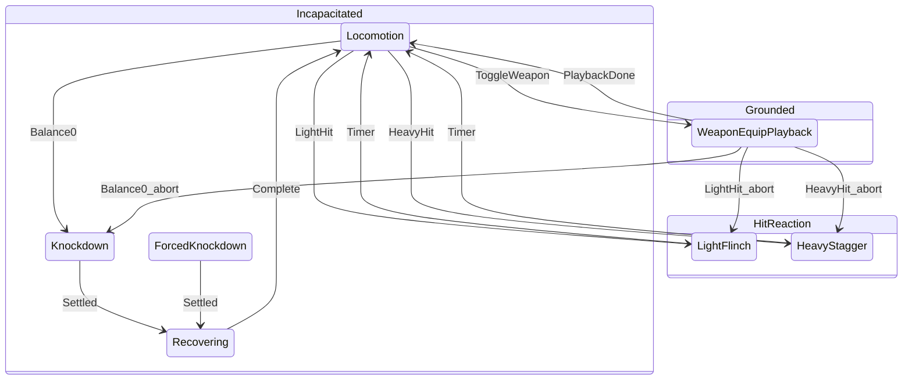
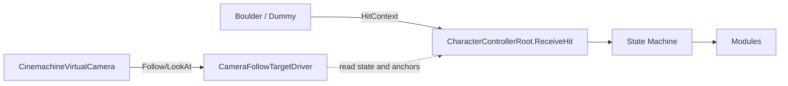

# 角色控制器架构设计

| 项 | 内容 |
|----|------|
| 文档版本 | 1.7 |
| 日期 | 2026-05-23 |
| 父文档 | [`架构设计.md`](架构设计.md) |
| 需求来源 | [`Unity_测试任务.pdf`](Unity_测试任务.pdf) |
| 引擎 | Unity **6000.3.13f1 (LTS)** |

---

## 1. 定位

本项目的**核心**是玩家身上的 **角色控制器（Character Controller）**：一个统一调度中心，负责在任意时刻决定——

- 是否接受玩家输入；
- 由 **动画** 还是 **刚体（布娃娃）** 驱动身体；
- 当前处于何种受击/起身阶段；
- 平衡值如何变化。

假人、滚石、相机 **不属于** 角色控制器内部；它们仅通过 **受击 API** 与 **输入** 与控制器交互。  
整体系统架构见 [`架构设计.md`](架构设计.md)；本文只展开 **玩家角色控制器**。

### 1.1 命名约定

| 名称 | 含义 |
|------|------|
| **角色控制器** | 本文所指逻辑系统（含状态机 + 子模块） |
| `CharacterControllerRoot` | 根 `MonoBehaviour`，系统唯一入口（避免与 `UnityEngine.CharacterController` 混淆） |
| `UnityEngine.CharacterController` | Unity 内置移动碰撞组件，仅用于 **地面 locomotion** 子模块 |

---

## 2. 设计目标

| 目标 | 说明 |
|------|------|
| **单一权威** | 同一帧内只有一个模块能写「移动模式、Animator 权重、Ragdoll 开关」 |
| **状态驱动** | 所有表现差异由「角色状态」推导，不散落 `if (isHit)` |
| **可测试** | 不接假人也能在 Inspector 里用调试按钮注入 `HitContext` |
| **可扩展** | 子模块通过接口挂在根上，便于替换 locomotion / ragdoll 实现 |
| **符合题面** | 俯视角移动、轻/重击、平衡击倒、全身/局部 ragdoll、起身 |

### 2.1 非职责（根组件不做）

- 假人攻击计时、滚石路径（世界层）
- 相机跟随（`CameraFollowTargetDriver` + Cinemachine Virtual Camera）
- UI 血条以外的全局游戏管理

---

## 3. 总体结构

角色控制器采用 **单一 MonoBehaviour 根（`CharacterControllerRoot`）+ 普通 C# 子模块类** 结构；在 `Awake` 中 `InitializeModules()` 构造子模块。子模块 **不是** 组件，**无自主切换状态** 的权限，仅响应根的 `OnEnterState` / `OnTick` 调用。Inspector 引用集中在 Root 的 `[Header]` 分组字段。

```mermaid
flowchart TB
    subgraph External["外部 External"]
        IN[PlayerInputReader]
        HIT_IN[IHitable / HitContext]
    end

    ROOT[CharacterControllerRoot<br/>HSM + 生命周期]
    HSM[CharacterStateMachine]

    subgraph Modules["子模块 Modules — 仅由 Root 调度"]
        LOC[CharacterMotor]
        ANM[CharacterAnimationPresenter]
        WEP[WeaponEquipPlaybackController]
        CBT[CharacterCombat<br/>含 Balance]
        RAG[CharacterRagdollSystem]
        REC[CharacterRecoveryFlow]
    end

    IN --> ROOT
    HIT_IN --> ROOT
    ROOT --> HSM
    ROOT --> LOC
    ROOT --> ANM
    ANM --> WEP
    ROOT --> CBT
    ROOT --> RAG
    ROOT --> REC
    ROOT --> RAL[CharacterRecoveryAlignment]
    ROOT --> DBG[CharacterDebugHitDriver]

    LOC --> UnityCC[Unity CharacterController]
    ANM --> Animator
    RAG --> Rigidbodies + Joints
```

### 3.1 依赖方向

```
外部 Hit / Input
    → CharacterControllerRoot（状态机）
        → CharacterMotor
        → CharacterAnimationPresenter
        → CharacterCombat（Balance）
        → CharacterRagdollSystem
        → CharacterRecoveryFlow
        → CharacterRecoveryAlignment（起身位置/朝向计算）
        → CharacterDebugHitDriver（调试受击注入，仅 CharacterControllerDebug 使用）
```

**禁止**：子模块互相直接调用（例如 `RagdollModule` 直接调 `AnimationModule.Play`）。若需要协作，经 `Root` 中转或走 `Root` 提供的只读上下文 `CharacterContext`。

---

## 4. 角色状态机（控制器核心）

> **专题说明**：HSM 设计动机、迁移图、API 用法与 Play 验收见 [`HSM层次状态机设计与使用.md`](HSM层次状态机设计与使用.md)。

玩法状态由 **`CharacterStateMachine`**（`Assets/Scripts/Character/StateMachine/`）管理：`CharacterControllerRoot` 持有 HSM，通过 `TryTransition` 迁移并调用各模块 `OnEnterState` / `OnExitState` / `OnTickState`。能力（移动、拔刀、受击）由 **`CharacterStateCapabilities`** 按子态查询，每帧写入 **`CharacterContext`**。

### 4.1 父态（Superstate）与子态

| 父态 `CharacterSuperstate` | 子态 `CharacterState` | 可移动 | 可拔刀/收刀 | 可受击 |
|----------------------------|----------------------|--------|-------------|--------|
| `Grounded` | `Locomotion` | ✓ | ✓（发起） | ✓ |
| `Grounded` | `WeaponEquipPlayback` | ✓ | ✗ | ✓ |
| `HitReaction` | `LightFlinch` | ✓ | ✗ | ✓ |
| `HitReaction` | `HeavyStagger` | ✓ | ✗ | ✓ |
| `Incapacitated` | `Knockdown` | ✗ | ✗ | ✗ |
| `Incapacitated` | `ForcedKnockdown` | ✗ | ✗ | ✗ |
| `Incapacitated` | `Recovering` | ✗ | ✗ | ✗ |

```csharp
public enum CharacterState
{
    Locomotion,
    WeaponEquipPlayback,  // Grounded：拔刀/收刀 overlay 播片
    LightFlinch,
    HeavyStagger,
    Knockdown,
    ForcedKnockdown,
    Recovering
}
```

### 4.2 状态 × 子模块行为矩阵

| 状态 | Locomotion | Animation | Combat/Balance | Ragdoll | Recovery |
|------|------------|-----------|----------------|---------|----------|
| `Locomotion` | 启用，读输入 | Idle/Run | 可扣点、可回复 | 全关 | — |
| `WeaponEquipPlayback` | 启用 | overlay（`WeaponEquipPlaybackController`） | — | 全关 | — |
| `LightFlinch` | 启用（题面：完整操控） | 四向 Flinch + 脊柱弯曲 | 已扣点 | 全关 | — |
| `HeavyStagger` | 降级移动可选 | 非受击部位继续 Stagger | 已扣点 | 仅受击链局部开启（硬切分权） | — |
| `Knockdown` | **禁用** | **关闭驱动** | 击倒后待 Reset | **全开** | 等待调用 |
| `ForcedKnockdown` | **禁用** | **关闭驱动** | 可不扣点 | **全开** | 等待调用 |
| `Recovering` | **禁用** | GetUp 独占 | — | 渐关 | 主导 |

### 4.3 状态转换规则（HSM 显式迁移表）



**拔刀规则**：`TryToggleWeaponEquip` 仅在 `CanToggleWeapon == true`（典型为 `Locomotion`）时成功；成功后迁入 `WeaponEquipPlayback`，由 `AnimationModule.OnTickState` 驱动 `WeaponEquipPlaybackController.Tick`。

**受击中止 overlay**：从 `WeaponEquipPlayback` 迁入 `HitReaction` / `Incapacitated` 前，Root 调用 `AbortWeaponEquipPlayback()`。

**免疫规则**：`Knockdown` / `ForcedKnockdown` / `Recovering` 期间 `ReceiveHit` 忽略（`CanReceiveHit == false`）。

---

## 5. 根组件 `CharacterControllerRoot`

### 5.1 职责

1. 持有 `CharacterStateMachine`、 `CharacterState CurrentState` 与 `CharacterContext`（含 `Superstate`、`CanMove`、`CanToggleWeapon` 快照）。
2. 对外 API：`ReceiveHit(HitContext)`、`OnInputMove(Vector2)`（或由 `LocomotionModule` 直连 Input，但须在 `Root` 许可状态下处理）。
3. 每帧按固定顺序驱动子模块（见 §7）。
4. 状态进入/退出：调用各模块 `OnEnterState` / `OnExitState` / `OnTickState`。

### 5.2 对外 API

```csharp
/// <summary>
/// 角色控制器根 — 受击与生命周期的唯一入口
/// Character controller root — sole entry for hits and lifecycle
/// </summary>
public class CharacterControllerRoot : MonoBehaviour
{
    public CharacterState CurrentState { get; }

    /// 世界对象调用：假人、滚石等
    /// Called by world objects: dummies, boulder, etc.
    public void ReceiveHit(HitContext context);

    /// 可选：供调试 Inspector 按钮
    public void DebugHitLight(HitDirection dir);
    public void DebugHitHeavy(HitDirection dir);
    public void DebugForceKnockdownLight(Vector3 direction, float impulse);
    public void DebugForceKnockdownHeavy(Vector3 direction, float impulse);
}
```

### 5.3 `ReceiveHit` 处理流程（伪代码）

```
ReceiveHit(ctx):
  if CurrentState in { Knockdown, ForcedKnockdown, Recovering }:
      return  // 免疫

  if ctx.BypassBalance:
      CombatModule.ForceDepleteBalance()
      Transition(ForcedKnockdown, ctx)
      return

  depleted = CombatModule.ApplyBalanceDamage(ctx)
  if depleted:
      Transition(Knockdown, ctx)
      return

  match ctx.HitType:
      Light  → Grounded态走overlay（不切LightFlinch子态）
      Heavy  → Transition(HeavyStagger, ctx)
```

`Transition(state, ctx)` 内部顺序：

1. 对旧状态：各模块 `OnExitState(old)`
2. `CurrentState = new`
3. 对新状态：各模块 `OnEnterState(new, ctx)`
4. 缓存 `ctx` 供本状态 Tick 使用（如冲量方向）

---

## 6. 子模块设计

### 6.1 `CharacterMotor` — 移动

| 项 | 说明 |
|----|------|
| 依赖 | `UnityEngine.CharacterController` |
| 输入 | 俯视角 XZ：将 `Vector2` WASD 映射到世界 XZ（相机 Y 轴旋转可选固定为 0） |
| 启用条件 | `Locomotion`、`LightFlinch`；`HeavyStagger` 可选 50% 速 |
| 禁用条件 | 击倒、起身：禁用组件或忽略输入 |

| 参数 | 默认 |
|------|------|
| `moveSpeed` | 待调 |
| `rotationSmooth` | 面向移动方向 |

**输出**：根 `Transform` 位移；通知 `AnimationModule` 当前速度用于 Idle/Run 混合。

---

### 6.2 `CharacterAnimationPresenter` — 动画

| 项 | 说明 |
|----|------|
| 依赖 | `Animator` |
| 职责 | Locomotion 参数、Flinch；**委托** `WeaponEquipPlaybackController` 处理拔刀/收刀 overlay |
| 装备子系统 | `WeaponEquipPlaybackController`（普通 C# 类）：层权重、CrossFade、Moving 锁定；由 `WeaponEquipPlayback` 子态 Tick |

| 状态 | 行为 |
|------|------|
| Locomotion | `Speed` → Idle/Run Blend |
| 地面轻击 overlay | Additive Flinch（`HitBlendX/Z`）+ **程序化弯曲**（`TorsoFacing` 定方向，`Spine`/`Head`/可选 `Neck` 施加，`LateUpdate`）；不切 `LightFlinch`；不 Abort 装备；可 E |
| LightFlinch（保留） | 非地面扩展；blend + 0.3s |
| HeavyStagger | 非受击部位保持 Stagger；受击链在 LateUpdate 物理姿态回写，动画去权 |
| Knockdown | `Animator.enabled = false`（或 culling） |
| Recovering | 播放 `GetUpBack` / `GetUpFront`；结束发事件给 Root |

**接口（由 Root 调用）**：

```csharp
void OnEnterState(CharacterState state, HitContext ctx);
void OnExitState(CharacterState state);
void OnTickState(CharacterState state, float dt);
bool IsGetUpFinished();  // Recovering 用
```

---

### 6.3 `CharacterCombat` — 战斗数值（平衡）

| 项 | 说明 |
|----|------|
| 职责 | 仅 **Balance** 与受击时间戳；不播动画、不开物理 |

| 方法 | 说明 |
|------|------|
| `bool ApplyBalanceDamage(HitContext ctx)` | 扣点；返回是否 ≤0（将击倒） |
| `void ResetBalance()` | 起身完成后由 Root 调用 |
| `void Tick(float dt)` | 无受击超过 delay 后回复 |

| 配置 | 默认 |
|------|------|
| max | 6 |
| light / heavy damage | 1 / 2 |
| regenDelay | 1.75s |

---

### 6.4 `CharacterRagdollSystem` — 布娃娃（双骨架）

| 项 | 说明 |
|----|------|
| 职责 | 双骨架映射、冲量驱动、静止检测、重击局部链与全身击倒 |

| 模式 | 触发状态 |
|------|----------|
| `Animated` | Locomotion、轻击 overlay、装备、Recovering 默认模式 |
| `PartialRagdoll` | HeavyStagger：命中链局部 dynamic 并回写 Visual |
| `FullRagdoll` | Knockdown、ForcedKnockdown：全身 dynamic 并回写 Visual |

| 方法 | 说明 |
|------|------|
| `EnterFullRagdoll(ctx)` | 全身动态并按接触点施加冲量 |
| `PlayHeavyReaction(ctx)` | 重击：仅受击链切到动态并施加冲量 |
| `ApplyHeavyPartialPoseLateUpdate()` | 重击阶段受击链物理姿态回写（防 Animator 抢权） |
| `bool IsSettled` | Recovery 轮询 |
| `CaptureRecoveryPose()` | 采样 ragdoll 终态骨骼局部旋转 |
| `CaptureRecoveryAnchor()` | 采样起身对齐锚点（Hips 位置 + 水平前向） |

**沉降门槛**：`IsSettled` 需满足“最小击倒时长 + 速度阈值 + 稳定时长”，避免瞬时进入 Recovering。  
**冲量来源**：`HitContext.Impulse`（调试/怪物攻击可覆盖），未指定时走类型默认值。  
**后端语义**：当前版本仅支持双骨架；初始化失败时后端为 `Unavailable`（无 legacy 回退）。
**参数边界**：Ragdoll 参数由 `RagdollSystemConfig` 提供；不再从 `CharacterControllerConfig` / `CharacterAnimationConfig` 回退读取。

---

### 6.5 `CharacterRecoveryFlow` — 起身

| 项 | 说明 |
|----|------|
| 触发 | Root 在 `Knockdown`/`ForcedKnockdown` 下检测到 `CharacterRagdollSystem.IsSettled` → `Transition(Recovering)` |
| 仰俯判定 | 由 `CharacterRagdollSystem.EvaluateGetUpType()` 输出；`CharacterRecoveryFlow` 不采样骨骼 |
| 流程 | Ragdoll settle → Root 对齐位置（默认不预旋转）→ Pose match → Play GetUp → 完成事件 |

**接口**：

```csharp
void BeginRecovery(RecoveryGetUpType getUpType, float fallbackRecoverDuration);
void MarkGetUpFinished();
bool IsComplete();
```

---

### 6.6 `CharacterRecoveryAlignment` — 起身对齐

| 项 | 说明 |
|----|------|
| 职责 | Knockdown→Recovering 过渡时的根节点位置校正、朝向判定、地面检测 |
| 依赖 | `Transform`（Root）、`Animator`（模型朝向）、`UnityEngine.CharacterController`（地面高度）、`CharacterAnimationConfig`（起身参数） |
| 独立原因 | 纯数学/物理计算，与状态编排无关，已从 Root 中提取为独立类 |
| 构造注入 | `rootTransform`、`animator`、`characterController`、`animationConfig`、`preAlignRotation`、`forceAlignMinAngle` |

```csharp
// 执行完整起身前对齐：位置校正 + 朝向判定与旋转
void AlignForRecovery(ref RagdollAnchor anchor, RecoveryGetUpType getUpType,
    out Vector3 resolvedForward, out bool shouldFlipBack,
    out float angleToAnchor, out bool appliedVisualRotation);

// 兜底时长：PoseMatch + CrossFade + targetClip + 0.8 秒缓冲
float ResolveRecoveryFallbackDuration(RecoveryGetUpType getUpType);
```

---

### 6.7 `CharacterDebugHitDriver` — 调试受击注入

| 项 | 说明 |
|----|------|
| 职责 | 提供 `DebugHitLight/Heavy`、`DebugForceKnockdownLight/Heavy` 调试方法及 `GetDebugContactPoint` 接触点解析 |
| 依赖 | `CharacterControllerRoot`（`ReceiveHit`）、`Animator`（Humanoid 骨骼回退）、`CharacterRagdollSystem`（物理骨骼接触点） |
| 独立原因 | 纯调试代码，仅被 `CharacterControllerDebug.OnGUI()` 调用，已从 Root 提取 |
| 构造注入 | `root`、`animator`、`ragdollSystem` |

---

## 7. 帧更新顺序

在 `CharacterControllerRoot` 中统一：

```
Update():
  1. CharacterCombat.TickBalance(dt)      // 平衡回复
  2. 若允许输入：读取 Input → CharacterMotor
  3. CharacterMotor.TickMovement(dt)
  4. CharacterAnimationPresenter.OnTickState(state, dt)
  5. CharacterRagdollSystem.OnTickState(state, dt)
  6. 状态机内部计时器（Flinch 结束、Heavy 融合结束）
  7. 若 state in {Knockdown, ForcedKnockdown} && CharacterRagdollSystem.IsSettled:
        CaptureRecoveryPose + CaptureRecoveryAnchor
        CharacterRecoveryAlignment.AlignForRecovery()（位置校正 + 朝向对齐）
        Transition(Recovering)
  8. 若 state == Recovering && CharacterRecoveryFlow.IsComplete():
        CharacterCombat.ResetBalance()
        Transition(Locomotion)

FixedUpdate():
  CharacterRagdollSystem.OnFixedTickState(state, dt)   // 仅物理相关状态
```

**原则**：逻辑状态在 `Update`；刚体力与 `AddForce` 在 `FixedUpdate`。

---

## 8. 共享数据

### 8.1 `HitContext`

```csharp
public readonly struct HitContext
{
    public HitType Type;           // Light, Heavy, ForceKnockdownLight, ForceKnockdownHeavy
    public HitDirection Direction; // Front, Back, Left, Right（或 Vector3）
    public Vector3 ContactPoint;
    public float Impulse;
    public bool BypassBalance;
    public Object Source;          // 调试用
}
```

### 8.2 `CharacterContext`（运行时快照）

```csharp
public class CharacterContext
{
    public CharacterState State;
    public CharacterSuperstate Superstate;
    public float StateTime;
    public bool CanMove;
    public bool CanToggleWeapon;
    public Vector3 WorldVelocity;
    public int CurrentBalance;
    public int MaxBalance;
    public bool IsWeaponEquipped;
    public bool IsLightFlinchOverlayActive;
    public HitContext LastHit;
    public bool IsRagdollSettled;
    public CharacterRagdollMode RagdollMode;
    public string RagdollBackendStatus; // Dual / Unavailable
    public string RagdollChainName;
    public int RagdollMappedBoneCount;
    public bool IsUsingDualRagdoll;
}
```

---

## 9. Prefab 组件挂载

`Player.prefab` 实际组件树（根节点 6 个 MB + Unity CC）：

```
Player (root)
├── CharacterControllerRoot         ← 唯一核心 MB；Inspector 内分组配置各模块引用
├── PlayerInputReader               ← 转发 Move / Equip / LightAttack / HeavyAttack
├── CharacterControllerDebug        ← 运行时调试 GUI
├── CharacterRagdollSystem          ← 双骨架布娃娃后端（Dual / Unavailable）
├── RagdollBoneMapper               ← Visual ↔ Physics 骨骼映射调试
├── UnityEngine.CharacterController
├── VisualModel (child)
│   ├── Animator                    ← 拖入 Root「Animation」分组
│   └── [骨骼层级]                   ← SkinnedMeshRenderer + CharacterHurtbox×9
├── RagdollRig (child)
│   └── [Ragdoll bone rigidbodies]  ← 物理骨架，仅配置在 CharacterRagdollSystem 中
└── Canvas (child)
    └── CharacterBalanceSliderBinder ← 调试用平衡值 UI Slider
```

子模块（`CharacterMotor`、`CharacterCombat`、`CharacterAnimationPresenter`、`CharacterRecoveryFlow`、`CharacterRecoveryAlignment`、`CharacterDebugHitDriver`）为 **普通类**，在 Root 的 `InitializeModules()` 中构造，**勿** Add Component。

**配置资产**（可选）：

- `CharacterControllerConfig`（SO）：速度、平衡、受击时长、冲量
- `CharacterAnimationConfig`（SO）：Animator 参数名、装备层与 overlay 播片
- `RagdollSystemConfig`（SO）：Ragdoll 沉降、重击局部、回融参数（`CharacterRagdollSystem` 主配置）
- `RagdollChainCatalog`（SO）：部位 → 骨骼链

---

## 10. 代码目录

```
Assets/Scripts/Character/
  CharacterControllerRoot.cs
  CharacterState.cs, CharacterContext.cs, CharacterAttackType.cs
  HitContext.cs, HitType.cs, HitDirection.cs
  ICharacterModule.cs              // OnEnter/OnExit/OnTick/OnFixedTick
  AnimationEventReceiver.cs
  PlayerInputReader.cs
  CharacterPoseSnapshot.cs, RagdollAnchor.cs
  StateMachine/
    CharacterStateMachine.cs       // 迁移表 + 能力查询
    CharacterSuperstate.cs
    CharacterStateCapabilities.cs
  Gameplay/
    CharacterMotor.cs
    CharacterCombat.cs
    CharacterRecoveryFlow.cs
    CharacterRecoveryAlignment.cs  // 起身位置/朝向计算
  Presentation/
    CharacterAnimationPresenter.cs
  Modules/
    WeaponEquipPlaybackController.cs
    CharacterAttackPlaybackController.cs
  Config/
    CharacterControllerConfig.cs   // 移动、平衡、受击时长
    CharacterAnimationConfig.cs    // Animator 参数、装备 overlay
  Debug/
    CharacterControllerDebug.cs    // 运行时注入 Hit GUI
    CharacterDebugHitDriver.cs     // 调试受击注入
    ClonePlayerAttackDriver.cs     // 假人自动攻击
    HitDirectionDebugHelper.cs     // 360° 方向浮标
    CharacterBalanceSliderBinder.cs
    DebugHitContactRegion.cs
  Editor/
    CharacterControllerRootEditor.cs
    PlayerAnimatorFlinchSetup.cs
Assets/Scripts/Ragdoll/
  CharacterRagdollSystem.cs        // 双骨架布娃娃（MB + ICharacterModule）
  RagdollBoneMapper.cs
  RagdollChainDefinition.cs
  RagdollChainCatalog.cs
  RagdollSystemConfig.cs
Assets/Scripts/Combat/
  CharacterHurtbox.cs
  WeaponAttackHitDriver.cs
Assets/Scripts/Gameplay/
  RollingBoulderKnockdown.cs
Assets/Scripts/Camera/
  CameraFollowTargetDriver.cs      // 击飞期跟随 ragdoll，恢复期回切 Player
Assets/Scripts/UI/
  WorldSpaceCanvasBillboard.cs
Assets/Scripts/Editor/
  FbxAnimationExtractTool.cs
```

---

## 11. 实现顺序（仅角色控制器）

| 步骤 | 内容 | 可验证 |
|------|------|--------|
| **C1** | `CharacterState` + `Root` 空状态机 + `Locomotion` + Input | WASD 移动 + Idle/Run |
| **C2** | Additive Flinch 2D + 躯干朝向脊柱/头/颈弯曲（无轻击 AddForce） | 见 [`C2-轻击Flinch编辑器搭建.md`](C2-轻击Flinch编辑器搭建.md) |
| **C3** | `CombatModule` + `ReceiveHit` 扣点与恢复（已接入） | Debug 面板显示 Balance 归零/回满 |
| **C4** | 轻击完整时序（overlay + 脊柱/头颈弯曲） | 方向与时序符合题面轻击，不依赖 `LightFlinch` 子态 |
| **C5** | 全身 Ragdoll + `Knockdown`/`ForcedKnockdown` | 调试窗口 `Force KO Light/Heavy` 按箭头方向触发，支持冲量覆盖，倒地后进入 Recovering（见 [`C5-双类型强制击倒改动说明.md`](C5-双类型强制击倒改动说明.md)） |
| **C6** | `RecoveryModule` + `Ragdoll/Animation/Camera` 协作 | 修复前后起身误判、修复起身瞬移、增加 PoseMatch 与目标时长控制、相机代理跟飞防抖（见 [`C6-起身实现说明.md`](C6-起身实现说明.md)） |
| **C7** | `HeavyStagger` 局部链硬切分权 | 受击链纯物理甩动，非受击部位保持 Stagger 动画（见 [`C7-重击局部布娃娃实现说明.md`](C7-重击局部布娃娃实现说明.md)） |
| **C8** | 双骨架重构（C8.1~C8.6）+ 与假人/滚石 `ReceiveHit` 对接 | C8.6 后仅保留双骨架路径，场景验收 |

相机跟飞已并入 **C6**；世界对象对接仍在 C8。

---

## 12. 接口与总架构的关系



[`架构设计.md`](架构设计.md) 中的 `HitReactionController`、`BalanceSystem` 等逻辑 **收敛** 为本文的子模块，不再作为与 Root 平级的第二套调度中心。

---

## 13. 待定项

| ID | 问题 | 倾向 |
|----|------|------|
| CC1 | 重击时是否限制移动速度 | 保留移动，速度 ×0.5 |
| CC2 | `Animator` 与 ragdoll 骨骼是否双套 | **已决**：双骨架（VisualModel + RagdollRig） |
| CC3 | 模块用独立 MonoBehaviour 还是普通类 | **已决**：普通类 + Root `Awake` 初始化；引用集中在 Root Inspector |
| CC4 | FBX 骨骼名与 `HitDirection` 映射表 | C1 后补 `docs/骨骼映射表.md` |

---

## 14. 修订记录

| 版本 | 日期 | 说明 |
|------|------|------|
| 1.0 | 2026-05-20 | 初稿：以 CharacterControllerRoot 为核心的专项设计 |
| 1.1 | 2026-05-20 | C1 代码落地；编辑器步骤见 `C1-角色控制器编辑器搭建.md` |
| 1.2 | 2026-05-20 | 重构：子模块改为普通 C# 类，单 Root MB + Header 分组配置 |
| 1.3 | 2026-05-22 | HSM：`CharacterStateMachine` + `WeaponEquipPlayback` 子态；装备逻辑迁至 `WeaponEquipPlaybackController` |
| 1.4 | 2026-05-22 | C3~C5 对齐实现：轻击 overlay 主路径、Force KO 双类型、调试冲量覆盖与接触点施力 |
| 1.5 | 2026-05-22 | C6 对齐实现：起身目标时长控制、事件优先解锁+兜底、位置对齐默认不预旋转、CameraFollowTarget 跟飞防抖 |
| 1.6 | 2026-05-23 | C8.6 对齐：移除 legacy 单骨架链路，文档统一为纯双骨架语义 |
| 1.7 | 2026-05-23 | P5 收口同步：Ragdoll 参数边界改为 `RagdollSystemConfig` 主导，更新 Recovery/Context/Prefab 配置说明 |
